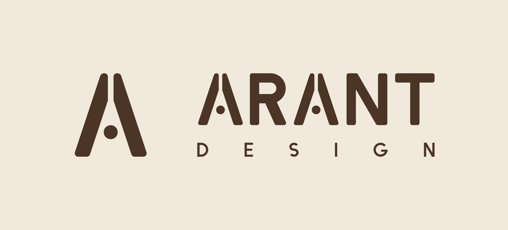

# ARANT DESIGN



**Objects for Considered Spaces.** ARANT DESIGN is a contemporary Indian objects and home-design studio. This monorepo
holds everything the studio designs and builds: the brand identity, its design language, product and packaging
mockups, the website, and the shared code they depend on.

## Brand kit and design language

Browse the brand pages online at **[sushant-kum.github.io/arant-design](https://sushant-kum.github.io/arant-design/)**:

- [Brand kit](https://sushant-kum.github.io/arant-design/brand-kit/): lockups, construction, clear space and minimum
  sizes, colour, type, the mark in use.
- [Design language](https://sushant-kum.github.io/arant-design/design-language/): principles, layout, photography,
  packaging, digital, social and voice.
- [Icons](https://sushant-kum.github.io/arant-design/icons/) and
  [Instagram templates](https://sushant-kum.github.io/arant-design/social/).

The site is built from this repo by `pnpm site:build` and published by
[`.github/workflows/pages.yml`](.github/workflows/pages.yml) on every push to `main` that touches `brand/` or the
tokens.

## What's here

| Area            | Path                                              | Status         | What it holds                                                              |
| --------------- | ------------------------------------------------- | -------------- | -------------------------------------------------------------------------- |
| Brand identity  | [`brand/identity`](brand/identity/)               | **v1.1 ready** | Logo masters, exports, web icons, print files, brand guide, build scripts  |
| Design language | [`brand/design-language`](brand/design-language/) | **v1 draft**   | Principles, colour, type, layout, photography, packaging, digital, voice   |
| Mockups         | [`brand/mockups`](brand/mockups/)                 | Planned        | Product, packaging and in-situ mockups                                     |
| Design tokens   | [`packages/tokens`](packages/tokens/)             | **v1.1 ready** | Colour and type as W3C design tokens, shared by everything above and below |
| Website         | [`apps/website`](apps/website/)                   | Planned        | arantdesign.com                                                            |

## Repository layout

```
arant-design/
├── brand/                    design material: artwork, guidelines, mockups (not deployed)
│   ├── identity/             logo system and icons: logo/, export/, print/, guide/, icons/, source/
│   ├── design-language/      how the brand looks and speaks beyond the logo
│   ├── social/               Instagram posts (posts.json) and rendered templates and posts
│   └── mockups/              product, packaging and environment mockups
├── apps/                     things that are deployed
│   └── website/              arantdesign.com
├── packages/                 code shared between apps and brand tooling
│   └── tokens/               design tokens: colour, type, spacing, layout, radius, motion
├── package.json              workspace root (private): scripts for building the brand assets
├── pnpm-workspace.yaml       workspace packages: apps/* and packages/*
├── ruff.toml                 Python formatter and linter settings
├── eslint.config.mjs         ESLint (flat config): JS/TS rules for every workspace
├── .prettierrc.json          Prettier settings (with .prettierignore)
├── .stylelintrc.json         Stylelint settings for CSS and SCSS modules (with .stylelintignore)
├── .secretlintrc.json        secretlint settings (recommended preset); respects .gitignore
├── knip.json                 knip settings: unused files, exports and dependencies
├── .husky/                   git hooks: pre-commit (lint-staged, knip) and commit-msg (commitlint)
├── .lintstagedrc.json        what runs on staged files at commit time
├── commitlint.config.mjs     commit message rules (Conventional Commits)
├── .czrc                     commitizen adapter for `pnpm tool::commit`
├── LICENSE                   brand assets: all rights reserved · code: MIT (see file for scope)
└── README.md
```

## Getting started

Requires [Node.js](https://nodejs.org/) 22 or later, [pnpm](https://pnpm.io/) 12, and Python 3 for the identity build
scripts. If your installed pnpm is a different version, pnpm downloads the one pinned in `package.json` automatically.
To lint or format the Python scripts, install [Ruff](https://docs.astral.sh/ruff/) with `pipx install ruff`.

```bash
pnpm install          # set up the workspace
pnpm identity:build   # rebuild all brand identity files from the tokens
```

| Script                  | Does                                                                                        |
| ----------------------- | ------------------------------------------------------------------------------------------- |
| `pnpm identity:check`   | Fail if a brand colour is hard-coded, or a token alias or recorded mix is wrong             |
| `pnpm identity:logo`    | Rebuild `brand/identity/logo/svg/`                                                          |
| `pnpm identity:exports` | Rebuild `brand/identity/export/` (one-colour files, PNGs, web and app icons)                |
| `pnpm identity:print`   | Rebuild `brand/identity/print/` (PDFs and JPGs)                                             |
| `pnpm identity:guide`   | Rebuild the brand guide and `palette.svg`                                                   |
| `pnpm identity:icons`   | Rebuild `brand/identity/icons/` (interface icon SVGs, sprite and preview)                   |
| `pnpm identity:social`  | Render `brand/social/templates/` and `brand/social/posts/` (Instagram frames)               |
| `pnpm identity:fonts`   | Restore the pinned Jost and Newsreader files used for rendering (needs network access)      |
| `pnpm identity:build`   | All of the above, in order                                                                  |
| `pnpm site:build`       | Build the GitHub Pages site into `site/` (gitignored) from the committed identity files     |
| `pnpm lint:py`          | Check Python formatting and lint rules with Ruff (config in `ruff.toml`)                    |
| `pnpm format:py`        | Format the Python scripts and apply safe lint fixes                                         |
| `pnpm lint`             | Lint JS/TS with ESLint (`eslint.config.mjs`); `lint:fix` fixes, `lint:error` hides warnings |
| `pnpm format:check`     | Check formatting with Prettier (`.prettierrc.json`); `format:fix` rewrites files            |
| `pnpm stylelint`        | Lint CSS/SCSS with Stylelint (`.stylelintrc.json`); `stylelint:fix`, `stylelint:error`      |
| `pnpm secretlint`       | Scan every tracked file for committed secrets (API keys, tokens, private keys)              |
| `pnpm knip`             | Find unused files, exports and dependencies across the workspaces (`knip.json`)             |
| `pnpm tool::commit`     | Write a Conventional Commit message interactively (commitizen)                              |

The export, print and guide steps need Chrome or Chromium (set `CHROME=/path/to/chrome` if it isn't on your `PATH`).

Workspace packages are named `@arant/*`. Add a new app under `apps/` or a shared package under `packages/` with its
own `package.json`, and pnpm picks it up. To use another workspace package, depend on it with
`"@arant/tokens": "workspace:*"`.

## Committing

`pnpm install` sets up the git hooks (husky). Every commit then runs:

- **pre-commit:** lint-staged on the staged files (ESLint, Stylelint, Prettier, Ruff for Python, the brand-token check
  when tokens or identity scripts change, and secretlint on everything), then knip over the whole project.
- **commit-msg:** commitlint, which requires a [Conventional Commits](https://www.conventionalcommits.org/) message
  such as `feat(identity): add seal lockup` or `fix(tokens): correct sand value`.

Run `pnpm tool::commit` to be prompted for a valid message. Committing Python files needs
[Ruff](https://docs.astral.sh/ruff/) on your `PATH` (`pipx install ruff`).

## Conventions

- **One home per thing.** Artwork and guidelines live in `brand/`. Anything that is deployed lives in `apps/`. Code or
  data used by more than one area lives in `packages/`.
- **Tokens are the source of truth.** Colour and type values come from `packages/tokens/tokens.json`. Don't copy hex
  values into new code: import the tokens, or update them there first.
- **Use the logo files; never redraw the logo.** Apps and mockups reference artwork in `brand/identity/` (or a build
  step copies it). Don't commit edited copies of the logo elsewhere.
- **Generated files carry their source.** Anything produced by a script sits next to a `source/` folder that can
  rebuild it, like `brand/identity/source/`.
- **Each area has its own README** covering what it contains, how to use it and how to rebuild it.
- **Versioning.** Tag releases per area, for example `identity-v1.1` or `website-v0.1`.
- **Large files.** Photography and high-resolution mockups belong in Git LFS once they arrive (see `.gitattributes`).

## Licence

See [`LICENSE`](LICENSE). In short, the ARANT names, marks and all brand assets are **all rights reserved**. The
source code in `brand/identity/source/` and `packages/` is **MIT**. Other code, including `apps/`, is all rights
reserved unless its folder contains its own licence file.
