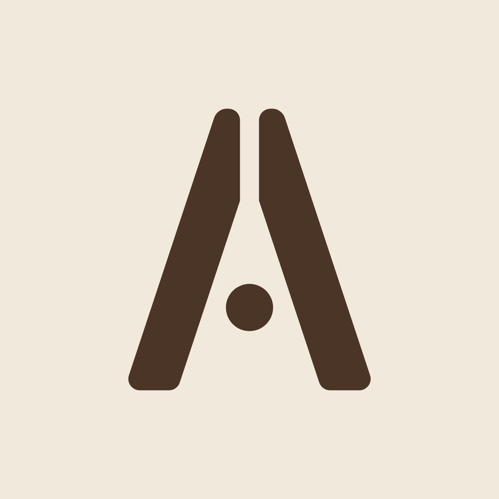
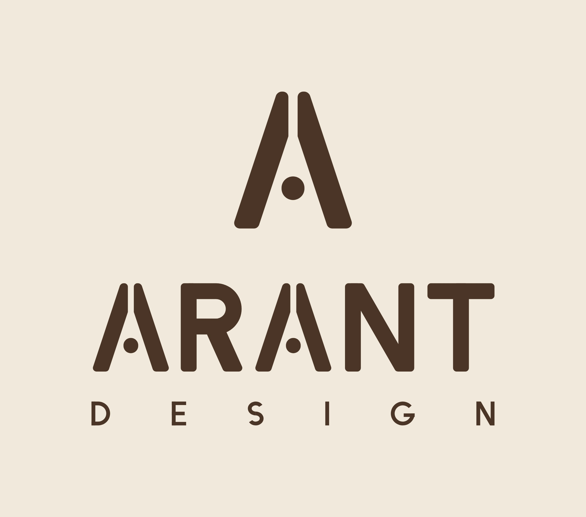
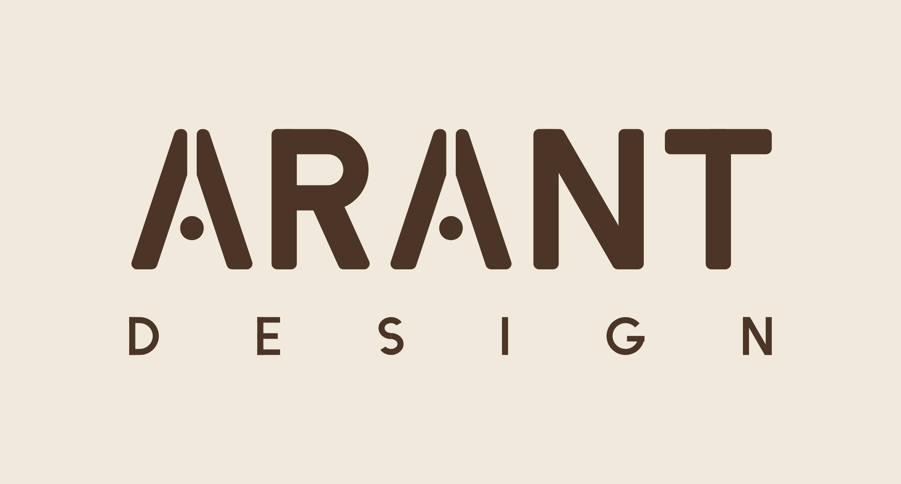
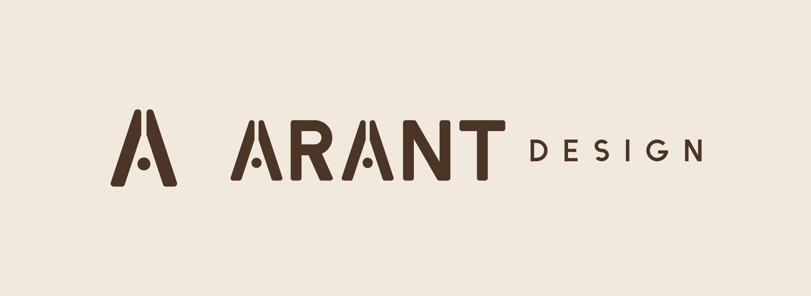
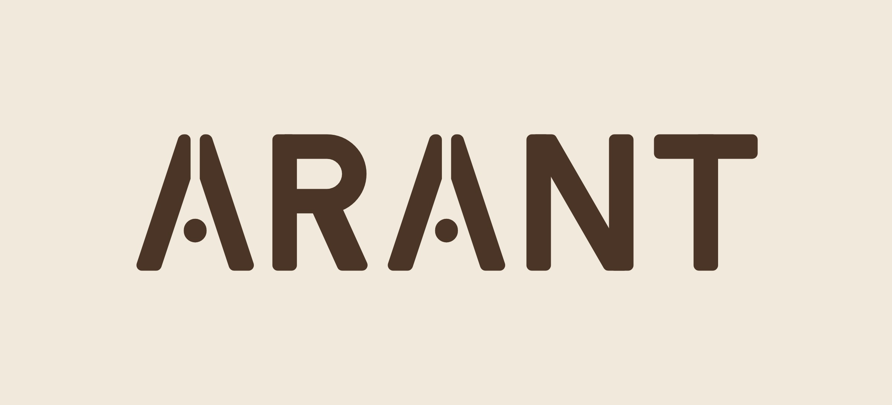
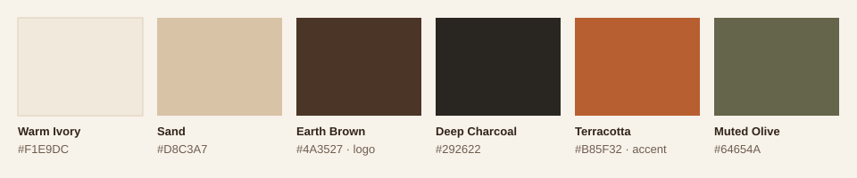
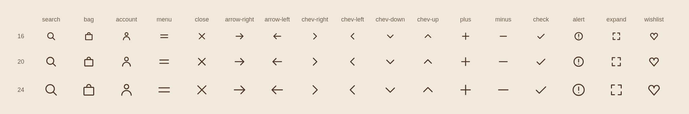

# ARANT DESIGN · Brand identity


**Objects for Considered Spaces.** The ARANT DESIGN logo system: master artwork, ready-to-use exports, print files,
the brand guide, and the scripts that generate all of them. Part of the [ARANT DESIGN monorepo](../../README.md).

**Version 1.1** · Brand guide: open [`guide/arant-brand-kit.html`](guide/arant-brand-kit.html) in a browser.

---

## The mark



**Balance.** Two equal stone slabs lean together and hold a pebble between them. The A becomes an object in balance:
architectural, tactile and quiet.

- **One opening, repeated.** The split between the slabs and the gap around the pebble share one width (5 % of the
  symbol grid). That rule is what lets the mark survive a rubber stamp, a blind deboss and a silicone mould.
- **Rounded caps and feet.** Nothing is narrower than the split, so there is nothing to chip in a mould.
- **A drawn wordmark.** ARANT is custom-drawn, never typed. Both As are the symbol itself, scaled to the cap height.
  R, N and T share its stroke (about 18 % of the cap height) and its corner radius. The N's diagonal sits at 60°.
- **DESIGN** is set at 27 % of the ARANT cap height and spaced to the exact width of ARANT.

## Logo versions

| Version                  | Preview                                                                                 | Use it for                                                          |
| ------------------------ | --------------------------------------------------------------------------------------- | ------------------------------------------------------------------- |
| **Horizontal** (primary) |  | Website header, packaging, documents                                |
| **Stacked**              |        | Labels, cards, square formats, signage                              |
| **Wordmark**             |             | Editorial use, and where the symbol already appears                 |
| **One line**             |      | Narrow bands: product wraps, email footers, sticky site header      |
| **ARANT only**           |     | Moulded into products and on small tags, where DESIGN would fill in |
| **Symbol**               |                  | Stamps, seals, product marks, social avatar, favicon                |

Use the horizontal lockup by default. Reach for the others when the space asks for it, never for variety.

## Which file do I need?

| I'm making…                               | Use                                                                                                                                                     |
| ----------------------------------------- | ------------------------------------------------------------------------------------------------------------------------------------------------------- |
| A website or app                          | `logo/svg/*.svg` (or `export/<version>/*.svg` for a single colour)                                                                                      |
| A favicon and app icons                   | `export/symbol/`: `favicon.ico`, `favicon.svg`, `apple-touch-icon.png`, PWA icons, `site.webmanifest`. Paste `head-snippet.html` into the page `<head>` |
| A social profile picture                  | `export/symbol/arant-symbol-app-icon-1024.png` (ivory on earth) or `arant-symbol-square-1024.png`                                                       |
| Something for a printer                   | `print/pdf/*.pdf` (vector, opens in Illustrator, Affinity, InDesign)                                                                                    |
| A rubber stamp, deboss die or mould       | The PDF or SVG in black: `print/pdf/*-black.pdf`. Check the minimum sizes below                                                                         |
| An email, document or marketplace listing | `print/jpg/*-on-ivory.jpg`, or the transparent PNGs in `export/<version>/`                                                                              |
| A dark background                         | The `-ivory` or `-white` versions in `export/<version>/`                                                                                                |

File names end in the colour's token name: `-earth`, `-charcoal`, `-terracotta`, `-ivory`, plus `-black` and `-white`
for production. The names stay the same if a colour value is ever adjusted. PNGs come at 600, 1200 and 2400 px wide
(symbol: 64–1024 px).

## Colour



| Name          | HEX       | RGB         | Role                                                                               |
| ------------- | --------- | ----------- | ---------------------------------------------------------------------------------- |
| Warm Ivory    | `#F1E9DC` | 241 233 220 | Ground for print and screen                                                        |
| Sand          | `#D8C3A7` | 216 195 167 | Secondary ground, tags, tissue                                                     |
| Earth Brown   | `#4A3527` | 74 53 39    | **Primary logo colour**                                                            |
| Deep Charcoal | `#292622` | 41 38 34    | Text, signage, maximum contrast                                                    |
| Terracotta    | `#B85F32` | 184 95 50   | Accent: one element per piece (a seal, a band, a rule); text 24 px and larger only |
| Muted Olive   | `#64654A` | 100 101 74  | Supporting colour, sparingly                                                       |

**Approved pairings:** Earth on Ivory (9.5 : 1) · Ivory on Earth · Earth on Sand (6.7 : 1) · dark brown on kraft ·
Ivory on Charcoal (12.5 : 1) · Ivory on Terracotta (3.7 : 1, seals and large sizes only).

These values are defined in one place only: the design tokens in [`packages/tokens`](../../packages/tokens/). Every
file in this folder is generated from them. The brand guide lists starting CMYK values. Confirm CMYK and any Pantone
matches on a printed proof. Ask the printer to build the dark browns as rich blacks.

## Typography

The logo is drawn, never typed. For everything around it, use two open-licence families (SIL Open Font License,
free for commercial, print and web use) from Google Fonts:

- **[Jost](https://fonts.google.com/specimen/Jost)**: labels, navigation, product details, prices, packaging copy.
  Regular 400 and Medium 500. Uppercase labels get `letterSpacing.label` (+0.2em) tracking.
- **[Newsreader](https://fonts.google.com/specimen/Newsreader)**: headlines, product names, stories, cards.
  Light 300 for display, Regular 400 for text. Never in all caps.

## Clear space and minimum size

Keep clear space on every side of half the ARANT cap height (for the symbol alone, a quarter of its height).
Minimum sizes follow one production rule: **every opening stays at 0.8 mm or more.**

| Version    | Screen                               | Print             | Stamp · deboss · mould · engrave                       |
| ---------- | ------------------------------------ | ----------------- | ------------------------------------------------------ |
| Horizontal | 180 px wide                          | 25 mm wide        | 82 mm wide (below that, use the symbol or ARANT only)  |
| Stacked    | 120 px wide                          | 18 mm wide        | 54 mm wide                                             |
| One line   | 190 px wide                          | 28 mm wide        | 116 mm wide (below that, use the symbol or ARANT only) |
| Wordmark   | 120 px wide                          | 18 mm wide        | 54 mm wide                                             |
| ARANT only | 16 px cap height                     | 2.5 mm cap height | 12 mm cap height                                       |
| Symbol     | 24 px (at 16 px the split closes up) | 6 mm tall         | 12 mm tall                                             |

Widths are measured on the artwork itself, not the margin built into the SVG files. In every lockup the narrowest
opening is the split in the As of ARANT, so the stamp column is the size at which that split reaches 0.8 mm (ARANT
at a 12 mm cap height). The screen and print columns also keep DESIGN legible, at about 7 px and 1 mm cap height;
DESIGN is larger in the one-line lockup (36 % of the ARANT cap height, against 27 %), which is why that row allows
a smaller ARANT. The wordmark has the same proportions as the stacked lockup's lettering, so it shares its sizes.

These are production rules of thumb. Before a first run, make one proof stamp and one test pour at the smallest size
you plan to use.

## Icons



Seventeen line icons for the website and other interfaces, drawn from the mark: straight strokes for the slabs, the
circle for the pebble, the arch, softened rectangles and 45° diagonals, on a 24 px grid with one 1.5 stroke and
rounded caps and joins. They are painted in `currentColor`, so they take the colour of the text beside them; no brand
colour is baked in.

search · bag · account · menu · close · arrow-left · arrow-right · chevron-left · chevron-right · chevron-up ·
chevron-down · plus · minus · check · alert · expand · wishlist

| File                      | Use                                                                                    |
| ------------------------- | -------------------------------------------------------------------------------------- |
| `icons/svg/<name>.svg`    | One icon per file: inline it, or import it with an SVG loader                          |
| `icons/sprite.svg`        | Every icon as a `<symbol id="icon-<name>">`, for `<svg><use href="…#icon-bag"/></svg>` |
| `icons/icons-preview.png` | The set at 16, 20 and 24 px, for review                                                |

Draw them at 16, 20 or 24 px. So the line stays close to the weight of Jost Regular beside it, set `stroke-width` to 2
at 16 px and 1.75 at 20 px (1.5 at 24 px is the default). With the sprite, set the custom property instead, for
example `.icon-16 { --icon-stroke: 2 }`. Give an icon a visible label or an accessible name, or `aria-hidden="true"` if
it is decorative. To add an icon, draw it in `source/build_icons.py` on the same grid and stroke, and rebuild.

## Social templates

`source/build_social.py` renders the Instagram tiles, carousel frames and story and reel covers into
[`brand/social/`](../social/README.md): a reusable set in `templates/` and finished posts, from
`brand/social/posts.json`, in `posts/`. It sits here because it shares `render.py`, the token reader and the logo
masters, and it is part of `pnpm identity:build` so a token change reaches the social files too.

## Fonts for rendering

Most of the pipeline draws only the logo, which is artwork, not type. The social frames need real Jost and
Newsreader, so `source/fonts/` holds the two variable fonts with their licences (`OFL.txt`: the SIL Open Font
License 1.1 allows bundling, embedding and redistribution). They come from the google/fonts repository at a pinned
commit, checked by SHA-256. The files are kept in the repo so builds work offline; `pnpm identity:fonts` restores
them and needs network access to `raw.githubusercontent.com`.

## Don't

- Stretch, squash or rotate the logo
- Close the split, move the pebble, or rearrange or resize the parts of a lockup
- Add shadows, outlines, gradients or other effects
- Recolour outside the palette
- Retype ARANT in a font
- Place the logo on busy photography without a calm area or a solid panel

## Folder layout

```
logo/svg/             masters in Earth Brown: symbol, symbol-reversed, horizontal, stacked,
                      one-line, wordmark, wordmark-short (ARANT only)
export/<version>/     one-colour SVGs (earth, charcoal, terracotta, ivory, black, white) + transparent PNGs
export/symbol/        favicon, app and PWA icons, site.webmanifest, head-snippet.html
print/pdf/            vector PDFs (Earth Brown, black, Terracotta), RGB
print/jpg/            JPGs on warm ivory
guide/                the brand guide (arant-brand-kit.html) and palette.svg
icons/                interface icons: svg/*.svg, sprite.svg, icons-preview.png
source/fonts/         Jost and Newsreader (OFL), used to render the social frames
source/               Python 3 scripts that generate everything above from the tokens (no dependencies)
```

## Rebuilding the artwork

Everything in this folder is generated. The geometry lives in `source/build_logo.py` and `source/glyphs.py`, and
every colour comes from [`packages/tokens/tokens.json`](../../packages/tokens/tokens.json). To change a colour, edit
the token, then rebuild:

```bash
pnpm identity:build     # from the repo root: check, then logo → exports → print → guide → icons → social
```

| Step                    | Script (in `source/`) | Writes                                                                                                   |
| ----------------------- | --------------------- | -------------------------------------------------------------------------------------------------------- |
| `pnpm identity:check`   | `check_tokens.py`     | Fails if a brand colour is hard-coded in the scripts, or an alias or recorded mix in the tokens is wrong |
| `pnpm identity:logo`    | `build_logo.py`       | `logo/svg/` masters                                                                                      |
| `pnpm identity:exports` | `build_exports.py`    | `export/`: one-colour SVGs, PNGs, favicon and app icons, `site.webmanifest`, `head-snippet.html`         |
| `pnpm identity:print`   | `build_print.py`      | `print/pdf/`, `print/jpg/`                                                                               |
| `pnpm identity:guide`   | `build_guide.py`      | `guide/arant-brand-kit.html`, `guide/palette.svg`                                                        |
| `pnpm identity:icons`   | `build_icons.py`      | `icons/svg/`, `icons/sprite.svg`, `icons/icons-preview.png`                                              |
| `pnpm identity:social`  | `build_social.py`     | `brand/social/templates/`, `brand/social/posts/`                                                         |
| `pnpm identity:fonts`   | `fetch_fonts.py`      | `source/fonts/` (not part of the build; needs network access)                                            |

The scripts need Python 3 and Chrome or Chromium (no Python packages); set `CHROME=/path/to/chrome` if it isn't on your
`PATH`. The shared helpers are `brand_tokens.py` (reads the tokens and does the colour maths) and `render.py`
(headless-Chrome rendering). No AI or EPS files are included: open any PDF in `print/pdf/` in Illustrator and save it as
AI or EPS.

## Licence

See [`LICENSE`](../../LICENSE). In short:

- **Brand assets: all rights reserved.** The ARANT and ARANT DESIGN names, the Balance symbol, the wordmark and
  everything in `brand/` belong to ARANT DESIGN. Publishing them here does not grant a licence to use them. Stockists,
  press, printers and manufacturers may use them only with written permission from the studio, via
  [arantdesign.com](https://arantdesign.com).
- **Build scripts: MIT.** The code in `source/` is free to reuse. That licence doesn't extend to the artwork it
  generates.
- **Fonts: SIL Open Font License 1.1.** `source/fonts/` holds Jost and Newsreader under their own licence (`OFL.txt`
  beside each font), not MIT.
